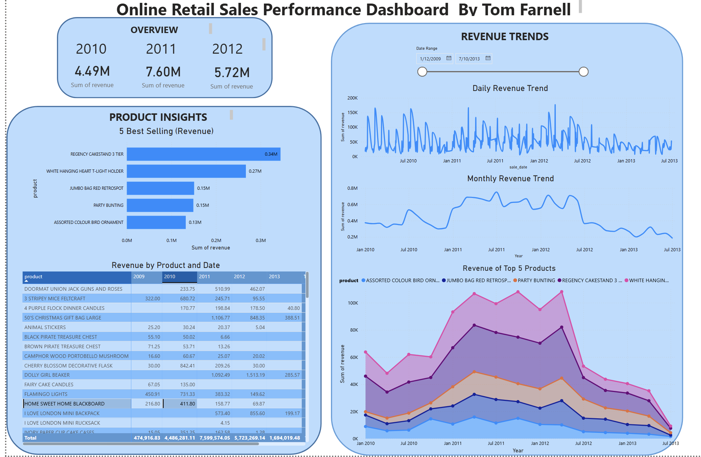
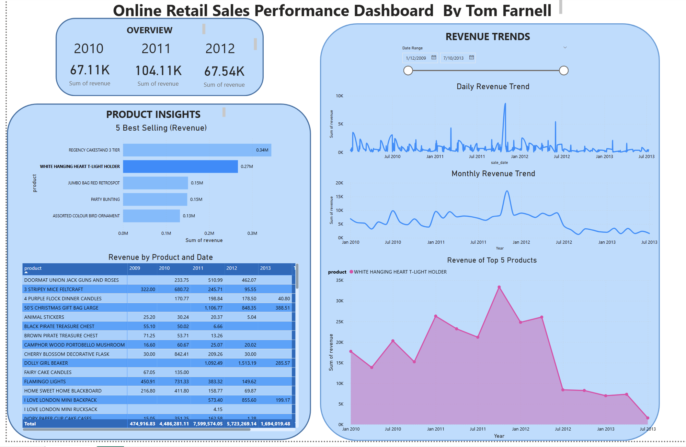
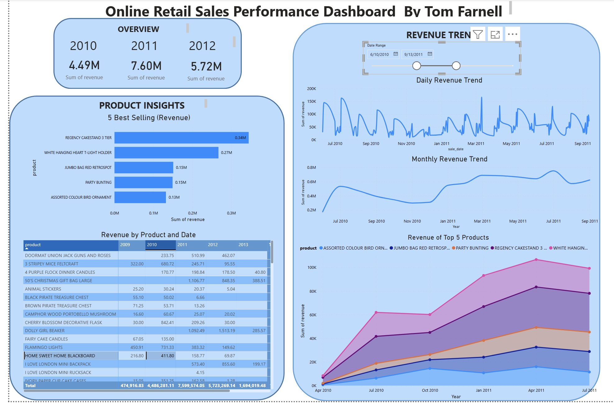

# Online-Retail-Sales-Analysis-and-Forecasting
Data cleaning, analysis, and sales forecasting project using a UK-based online retail dataset. Includes SQL-based preprocessing, Power BI dashboard

# 🛍️ UK Online Retail Sales Analysis & Power BI Dashboard

This project uses transaction-level data from a UK-based online store to explore product sales, returns, and customer behavior. It combines SQL-based data cleaning with interactive visual reporting in Power BI.

---

## 📦 Dataset

- Source: [UCI Machine Learning Repository](https://archive.ics.uci.edu/ml/datasets/Online+Retail)
- ~500,000 transactions (2010–2011)
- Columns: Invoice, StockCode, Description, Quantity, InvoiceDate, UnitPrice, CustomerID, Country

---

## ⚙️ Tools Used

- **PostgreSQL (via DBeaver)** — for data cleaning, filtering, and transformation
- **Power BI** — for dashboard creation and visual storytelling
- (Optional: Python for forecasting with XGBoost or Prophet)

---

## 🧹 Data Cleaning (SQL)

Cleaning and transformation steps included:

- Removing returns (`Invoice` starting with `'C'`)
- Filtering out entries like "POSTAGE", "DISCOUNT", "SAMPLES"
- Calculating total revenue: `Quantity * Price`
- Aggregating sales per product per day

📄 View all SQL steps: [`Output/SQL/Online_retail_Cleaning.sql']

---

## 📊 Dashboard Highlights (Power BI)

- 📈 Revenue trends (daily, monthly, yearly)
- 📦 Top-selling products
- 🌍 Sales by country
- 🔁 Return/cancellation rates
- 🧭 Interactive filters for time & product category

📁 File: [`Output/PowerBI_Dashboard/Online_Retail_Dashboard_copy.pbix]

---

## ✅ Project Outcomes

- Cleaned and transformed large transaction dataset using SQL
- Built a dynamic and filterable sales dashboard
- Gained insights into product demand, customer behavior, and returns
- Demonstrated ability to connect SQL and BI tools in real-world workflow

---

## 💡 Possible Extensions

- RFM (Recency, Frequency, Monetary) customer segmentation
- Forecasting with XGBoost or Prophet
- Deploy as an interactive web dashboard (e.g. Streamlit or Dash)

